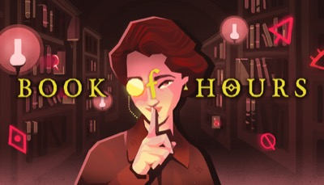
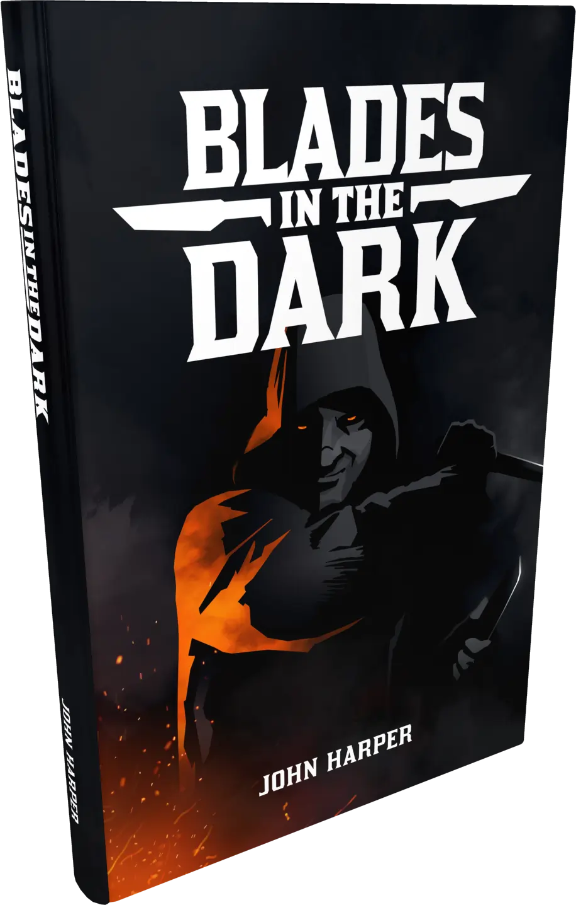

我没能完整地玩儿下去，但我觉得其中一部分，有些东西很有意思

1. FTL GDC talk 
   > 他们创作的过程是一个模拟游戏好的设计过程, 也让我看到一个好的机制设计师是什么样子, 和他们相比较，我就知道自己不是一个好的机制设计师.

2. 将游戏设计视为探索而非工作 - jonas tyroller 
   > fun, attractive, scope 游戏开发的几个关键评估标准
   >
   > 我认为深海探索的概念, 玩法原型和艺术原型区分开来的想法非常棒, 让我们可以专注在一个方面, 不被打断, 不必背负舍弃的负担
   >
   > 船长的想法也很棒, 是团队分工合作中的一环

3. 边缘世界 RimWorld 
   
   > 学! 故事模拟器!

4. 超越光速 FTL: Faster Than Light 
   

   > 学! 策略设计!

5. 勇者斗恶龙：创世小玩家2 破坏神席德与空荡岛 ドラゴンクエストビルダーズ2 破壊神シドーとからっぽの島 
   
   > 从好玩移动而来, 因为我很少想起他. 生活模拟, 如果是多人, 会更好玩

6. 勇者斗恶龙7 重制版 ドラゴンクエストVII Reimagined 
   
   > 画面很好,ui很好,手感很好, 故事也有点睛之笔, 在许多年前应该是一个好的作品，但是在今天这个讲故事的方式显得拖沓，不和谐!

7. 司辰之书 BOOK OF HOURS 
   
   > 我认为这个作品比《密教模拟器》概念更清晰，而且节奏更自由，没有那么紧张。他也开始展开，和故事，世界融合在一起，很有趣。
   > 作者在访谈中说，它的游戏机制和叙事更和谐地融合在一起，这也是我想做的东西。
   > 
   > 但是我不喜欢的一点是，你很难直观地知道什么<东西>能<做>什么，你需要拼命尝试，点击找到可用选项，这让人很沮丧
   >
   > 游戏的驱动力是：好奇心，这个东西还能怎么组合，还有什么新的，这一点和密教模拟器是一样的；游戏的一个hook是图书馆

8. 密教模拟器 Cultist Simulator 
   
   
   > 这个游戏看起来像是卡牌游戏，但并不。它们虽然长着卡牌的样子，但是每一个东西都是不一样的。我喜欢这个概念，而且我认为桌游的表现形式是做原型的一种好的方式。
   >
   > Codex 注：
   > - 参考：
   >   [Weather Factory](https://weatherfactory.biz/cultist-simulator/),
   >   [Alpha and the Why](https://weatherfactory.biz/cultist-simulator-the-alpha-and-the-why/),
   >   [itch.io 采访](https://itch.io/blog/37131/the-internet-is-not-a-kind-place-for-human-brains-an-interview-with-the-masterminds-behind-cultist-simulator)

9. 暗夜刀锋 Blades in the Dark 
   

10. 国王，Thronefall，yes, your grace 里面的收获金币-消耗金币-防御 的资源逻辑