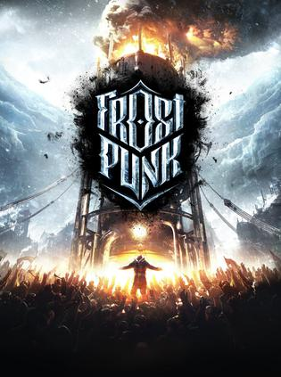
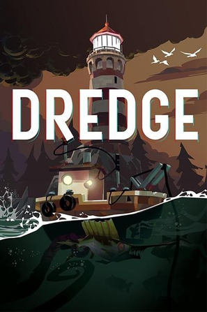
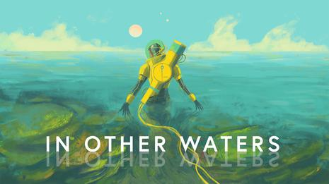
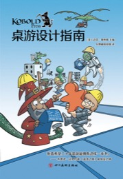
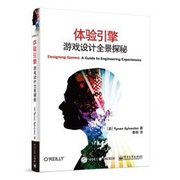
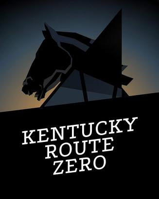
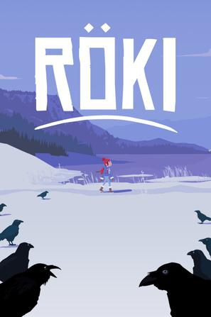

作为一个从业者，脑袋常常被屁股左右，被金钱和工作压力不知不觉地影响自己的观点。我想提醒自己，要自由地思考，在这个列表里抛开一切，只有一个标准，你只需要问你自己——你有没有感动，被拥抱的那种感动。

过去我玩过很多游戏, 有些是为了从现实中逃避出来, 大多数是和朋友们一块儿找个事儿做. 当我离开我的朋友们的时候, 那些我都不愿意再玩了。那么丢弃了那些游戏之后, 还剩下什么你喜欢的, 能完整玩下来的.

以我对自己的了解, 我是一个讲故事的人, 游戏是一种讲故事的方式. 不过在做游戏的时候, 也会很容易用一些条条框框去限制自己, 比如说我过去做过一些叙事游戏，那么我就会想, 我就适合这些, 而不适合另外一些类型, 根据我对自己的看法, 根据我对过去经历总结出的经验我会形成一套成见, 它帮助我集中精神, 也限制我的视野。但是我想如果你真的被某个东西打动了, 你感受得到它的美, 那么真实的感受应该要超越被总结出的经验, 它应当被接纳, 成为新的规则。也就是说，感受汇聚成经验，在某些时候要相信自己的感受，要超越经验，当然更要超越外界的权威和知识。

Frostpunk是8-10小时, 有一个吸引人的故事的
A Short Hike是2-3小时, 拥有一个轻松的氛围, 简单的机制, 在中午玩儿完的甜品
Dredge是8-10小时, 让我一直好奇后面还有什么神秘的东西的
这些我都很喜欢

我想再提醒自己一点。其实不仅是工作会影响我的判断，对游戏的认识也会，比如说游戏其实源自街机，所谓"正统"其实是格外强调游戏性(gameplay)的, 有时候我会太关注原创的游戏性-一个我没有才能, 也并不感兴趣的东西, 而忽略了其他可贵的事物。

关键词：叙事驱动，体验引擎，人文, 策略选择, 探索, casual, 简洁, 生活, 新颖,
负面关键词：非战斗,非反应,非计算, 非高度重复

------

1.弗洛伦斯 Florence 

看到[鸭鸭侦探 Duck Detective](./好看)让我理解了为什么Florence是一个非常好的游戏。Florence的游戏结构同样也是收集-推进，但不是对显而易见目标的点击，也从不让人感到模式的重复，它的谜题和动作和游戏情景高度融合，和生活相仿，并激发产生对应的情感，另外它还有一个让人记忆深刻的故事和个性鲜明的插画艺术风格。
另一个在谈话的语言和美术风格上幽默和轻松清新，但你一旦开始玩，开始做点什么，它就一点都不轻松有趣了，只是让人感到重复和无聊，感到为了故事而忍受，但故事也并不吸引人。
点击，探索，收集线索的冒险故事是一种类型，用文本+场景点击的形式来探索世界，推进故事，然而我想这一点并没有衍生出变奏

2.冰汽时代 Frostpunk 

充满紧张，但是又触动人心

3.短途旅行 A Short Hike 

探索, 温馨, 一个简单但有趣的机制和成长把一切串联起来, 有意思

4.渔帆暗涌 DREDGE 

探索, 冒险, 发现. 

5.深空梦里人2 Citizen Sleeper 2: Starward Vector 

好玩

6.孤星寂海 In Other Waters 

好玩, 不是那种强烈牵引着你, 让你心跳加速欲罢不能的东西. 它安静, 和谐, 优雅, 引人深入, 让人回味. 我以为它会把流程做长, 我看着那个47%的进度, 已经有些厌烦的时候它正好结束了, 很好, 不多也不少。

7.桌游设计指南 

游戏书籍里我读过最有用的书，其他书里讲到的丰富的细节后来我都忘了，这本书我却常常想起来。

8.体验引擎 

9.越过阿尔卑斯山 Over the Alps 

精致的互动绘本, 文本的互动性很强, 给我的代入感最强的文字互动. 虽然玩第二个故事会觉得有点无聊(其实第二个更加抓人, 更戏剧化)

10.孤山速降 Lonely Mountains: Downhill 

喜欢他的探索，casual感，一点技巧，不喜欢挑战。我更希望他能变成短途旅行那样的，趣味，探索。
<孤山独影>是我应该去玩的一个游戏, 我觉得我会喜欢

11.肯塔基零号国道 Kentucky Route Zero 

并不是特别喜爱的游戏，但是它和roki，oxenfree一起，让我看到游戏的可能性, 拓宽了游戏设计的边界
有些游戏需要你坐下来，安静下来和他交流。

12.洛基：北欧怪奇之旅 Röki 

怪兽aho！

13.舒林 Cozy Grove 

系统简单流畅的生活模拟, 我喜欢他的系统流畅和谐, 不喜欢它的重复.
如果是多人就好了, 或者如果是一段简单的旅途就好了.
https://www.jank.cool/i-want-to-discover-new-worlds-subnautica-2/ 这篇文章里面列举了许多关于探索和发现的事情。在 Cozy Grove 里面，探索和发现新的东西其实很有趣，但是一旦第二天重复，或者开始经营建设，事情就变得无聊了。应该这么说，这个游戏一开始是探索和发现, 简单的点击在这个世界中也会带来很多的可能性。然而，在完成一次任务之后，这个东西就不再具有探索的乐趣了，它变成了一个手段——为了你的露营，建立一个你自己的家，去养育一些什么一个更高目标的一部分，对我来说，建造养育不是我感兴趣的，所以说，玩了几天之后，我就对他失去了兴趣。

包括在孤山速降里，我觉得挑战有些太大了，但是它的探索和环境氛围仍然让人享受。孤山独影那个攀登游戏，它是一个技巧游戏，但探索的成分也很多。
subnautica以及 outer world 也被视作这种游戏，但是对我来说，不知道是因为3D还是那种自由自在的探索，缺乏目标感，我总是没办法沉浸进去。

14.奥森弗里2：信号丢失 OXENFREE II: Lost Signals 

我以为我不喜欢他, 但我常常想起它, 它在构筑游戏世界时候的那些谈话, 那些闲言碎语

15.节奏光剑 Beat Saber 

