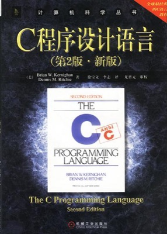
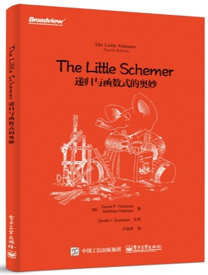
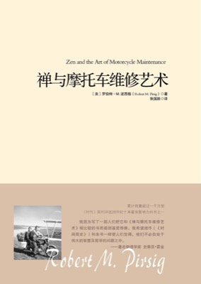
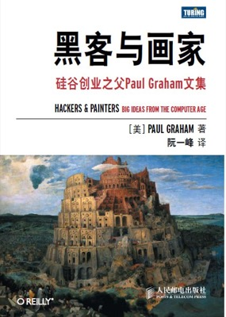
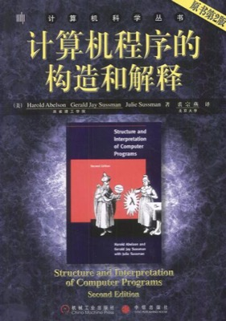
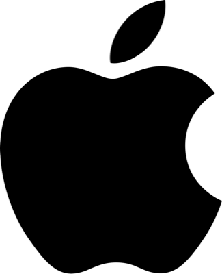
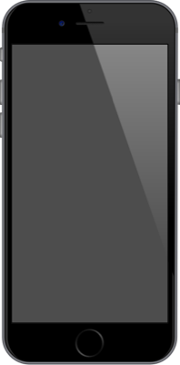
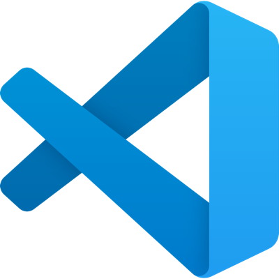
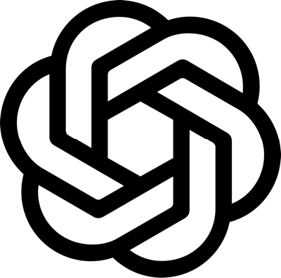

对于编程我并没有什么天分，过去的经验让我变得熟练, 让我感觉自己很聪明。但当我真正深入其中, 开始处理越来越复杂的东西的时候，我就开始头疼。而且最重要的是，我没有想法, 我无法创造一些东西。
我觉得在我做游戏的过程中，不是导师一样的人物Paul，也不是那些X上的创业者帮我很多, 真正帮我明白如何创作和创作了什么的, 是一些其他的东西，比如说科恩兄弟, BobDylan, 比如说马尔克斯或者其他的作家。
我仍然认为保罗是一个非常聪明和厉害的人物,但他的文章，他在X上的一些金句, 给我的帮助不大。我想他他在年轻的时候也不会去相信这样一些东西。X的金句可以作为他运营的YC的影响力，也能够作为他散文的引言, 但这些是门，是台阶，不是真正宝贵的东西。我想他是知道这一点的，他也在利用这一点。

1.C程序设计语言 

2.The Little Schemer 

3.禅与摩托车维修艺术 

4.黑客与画家 

5.计算机程序的构造和解释(原书第2版) 

我在看视频，视频更加短，我也从中学到了很多想法。书的内容实际上挺多的。

6.apple 

7.iPhone 6 

8.smartisan 

9.smartisan T2 

10.vscode 

11.chatgpt 

12.valve 

13.klei 

14.rimworld 

