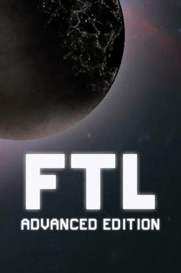
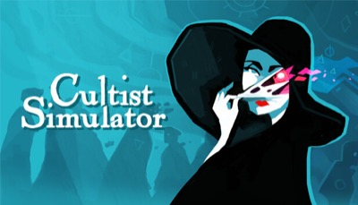
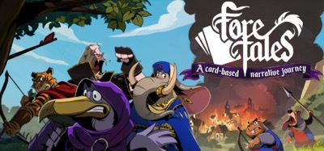
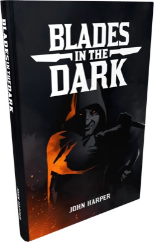
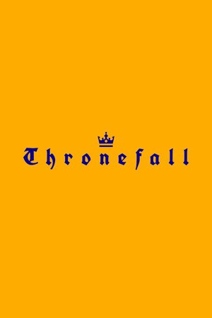
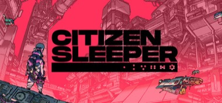

这里放了一些游戏，我没有完整地玩完，或者说我并不觉得它特别好玩，又或者说它对我缺乏吸引力。尽管如此，但我仍然感觉到它有些地方很有意思，我觉得它是有想法有特色的，其中有一些部分我是可以参考和借鉴的。

1.FTL GDC talk [](https://www.bilibili.com/video/BV1tLQzYoEKN/?spm_id_from=333.337.search-card.all.click)
他们创作的过程是一个模拟游戏好的设计过程, 也让我看到一个好的机制设计师是什么样子, 和他们相比较，我就知道自己不是一个好的机制设计师.

2.将游戏设计视为探索而非工作 - jonas tyroller [](https://www.bilibili.com/video/BV1Hz421X777/?spm_id_from=333.337.search-card.all.click)
fun, attractive, scope 游戏开发的几个关键评估标准
我认为深海探索的概念, 玩法原型和艺术原型区分开来的想法非常棒, 让我们可以专注在一个方面, 不被打断, 不必背负舍弃的负担
船长的想法也很棒, 是团队分工合作中的一环

3.边缘世界 RimWorld [](https://www.douban.com/subject/26366333/)

学! 故事模拟器!

4.超越光速 FTL: Faster Than Light [](https://www.douban.com/subject/20471637/)

学! 策略设计!

5.勇者斗恶龙：创世小玩家2 破坏神席德与空荡岛 ドラゴンクエストビルダーズ2 破壊神シドーとからっぽの島 [](https://www.douban.com/subject/27110728/)

从好玩移动而来, 因为我很少想起他. 生活模拟, 如果是多人, 会更好玩

6.勇者斗恶龙7 重制版 ドラゴンクエストVII Reimagined [](https://www.douban.com/subject/37523509/)

画面很好,ui很好,手感很好, 故事也有点睛之笔, 在许多年前应该是一个好的作品，但是在今天这个讲故事的方式显得拖沓，不和谐!

7.司辰之书 BOOK OF HOURS [](https://store.steampowered.com/app/1028310/BOOK_OF_HOURS/)

我认为这个作品比《密教模拟器》概念更清晰，而且节奏更自由，没有那么紧张。他也开始展开，和故事，世界融合在一起，很有趣。
作者在访谈中说，它的游戏机制和叙事更和谐地融合在一起，这也是我想做的东西。
但是我不喜欢的一点是，你很难直观地知道什么<东西>能<做>什么，你需要拼命尝试，点击找到可用选项，这让人很沮丧
游戏的驱动力是：好奇心，这个东西还能怎么组合，还有什么新的，这一点和密教模拟器是一样的；游戏的一个hook是图书馆

8.密教模拟器 Cultist Simulator [](https://store.steampowered.com/app/718670/Cultist_Simulator/)

这个游戏看起来像是卡牌游戏，但并不。它们虽然长着卡牌的样子，但是每一个东西都是不一样的。我喜欢这个概念，而且我认为桌游的表现形式是做原型的一种好的方式。
Codex 注：
- 参考：
  [Weather Factory](https://weatherfactory.biz/cultist-simulator/),
  [Alpha and the Why](https://weatherfactory.biz/cultist-simulator-the-alpha-and-the-why/),
  [itch.io 采访](https://itch.io/blog/37131/the-internet-is-not-a-kind-place-for-human-brains-an-interview-with-the-masterminds-behind-cultist-simulator)

9.苏丹的游戏 Sultan's Game [](https://store.steampowered.com/app/3117820)

刚开始觉得很有意思, 故事很吸引人, 也很新颖。不过玩了三四轮之后, 太复杂了, 和密教模拟器一样让人玩起来很累。当一个故事往前推进的时候，你不知道那东西从哪里来，于是漫无目标的等待。你也不知道一个位置能放什么东西，于是一个一个去试。玩起来很疲惫，很烦躁。给我的感觉就好像下面这个用户的评论一样。
```
游戏过程极其枯燥乏味。连续八十回合（！！）点击同一个故事提示简直太疯狂了.
库存管理很快就会变得极其麻烦。排序功能差强人意，而且你会拥有数量惊人的卡牌
总而言之，游戏里充斥着太多杂乱无章的东西。你完成的关卡越多，目标越多，解锁的升级和新路线就越多，但说实话，我感觉这简直是一种惩罚，因为它们只是给游戏增加了更多繁琐的重复劳动。
游戏的画面很棒，设定和故事也很有意思，但我实在提不起劲再打开它，因为感觉就像是在做苦差事。我玩了40个小时，却几乎没看到任何结局奖励，十几个结局里大概只看到了两个？而且还是最简单的结局。一部分原因是翻译很烂，让人搞不清楚该做什么，另一部分原因是做任何事都要花费太多时间。这40个小时玩下来，你只会想"哇，这游戏偷走了我这么多时间"，而不是"哇，这真是个充实的消磨时间的方式"。
```   
通过[Wiki](https://wiki.biligame.com/sultansgame/%E9%80%83%E7%A6%BB%E8%8B%8F%E4%B8%B9%E7%9A%84%E6%B8%B8%E6%88%8F)，我也觉得太复杂，无法理解。他们是很优秀的设计师，但这条路我走不通。我做不了这个，也不会再玩，但也许还有另外一条路......

10.预言奇谈 Foretales [](https://www.douban.com/subject/36094829/)


11.暗夜刀锋 Blades in the Dark [](https://evilhat.com/product/blades-in-the-dark/)


12.国王 Thronefall

yes, your grace 里面的收获金币-消耗金币-防御 的资源逻辑

13.孤山速降 Lonely Mountains: Downhill [](https://www.douban.com/subject/27052376/)

记得去玩孤山独影Cairn， 也让我想起短途旅行a short hike

14.深空梦里人 Citizen Sleeper [](https://www.douban.com/subject/35507913/)

